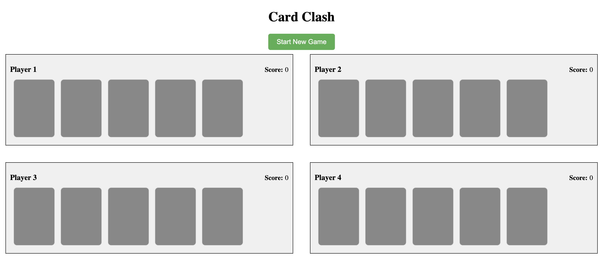
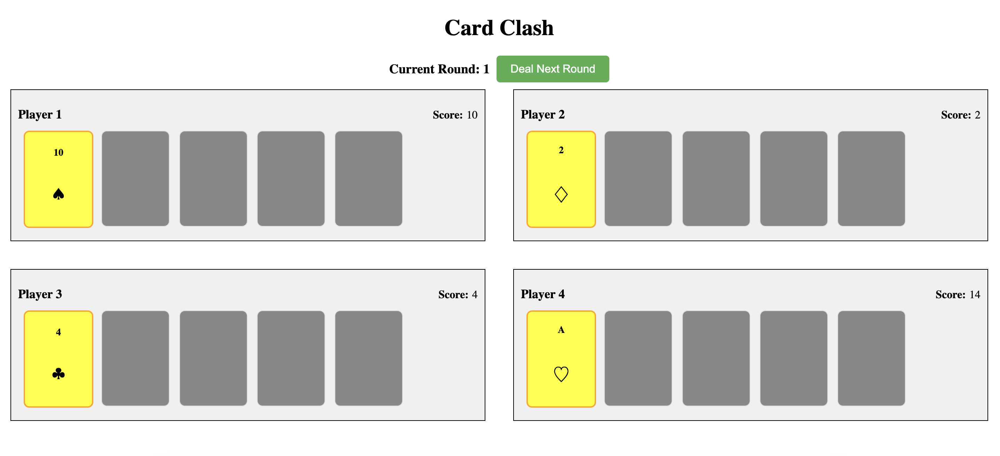
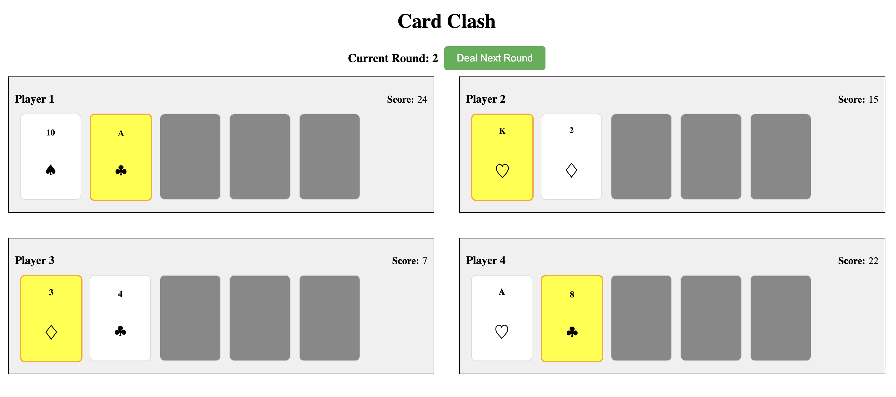
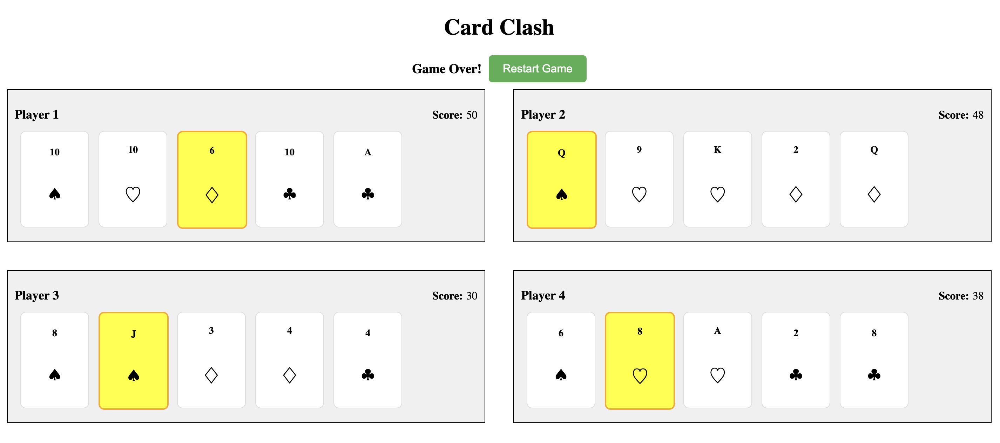

# Card Clash - A Card Game

## Description

Card Clash is a card game where players compete over multiple rounds. Each round, every player is dealt a single card. The game continues until the maximum number of rounds is reached, and the total score of each player is calculated based on their cards' values.

## Features

- **Configurable Gameplay**: Customize the number of players, max card slots, and the deck of cards in `config.json` in the assets folder.
- **Dynamic Player Creation**: Players are dynamically created as per the number specified in `config.json`.
- **Card Slot Management**: Generates card slots for each player based on the configuration.
- **Game Initialization**: Initially, cards are shuffled (not dealt) as the game awaits start.
- **Starting the Game**: Click "Start New Game" to begin. Each player is dealt a single card, with remaining slots empty.
- **Interactive UI**: Displays each player, their cards, and current scores.
- **Round Progression**: Click "Deal Next Round" to deal an additional card each round until all rounds are complete.
- **Restarting the Game**: Post final round, "Restart Game" appears. Clicking it shuffles new cards and restarts the game.

## Development Highlights

**Semantic HTML**
I have used semantic HTML to ensure that the structure of the web page is meaningful and to enhance the accessibility.

**Comprehensive Testing**
All components and services are tested covering a wide range of cases, to ensure reliability and stability.

## Components

- **CardComponent:**
  The CardComponent is a visual representation of a card in the game
- **GameComponent:**
  The GameComponent manages the main game interface, handling the display of players and cards.
- **GameControlsComponent:**
  The GameControlsComponent manages game control actions, like starting a new game, dealing the next round, and restarting the game. It monitors and reacts to changes in the game state.
- **PlayerComponent:**
  The PlayerComponent represents an individual player in the game, displaying their ID, score, and cards. It dynamically updates to show the player's current hand and score.

## Services

- **GameInitializationService:**
  Responsible for initializing the game state based on configuration settings. Sets up game components like players and cards, relying on ConfigService for customization.

- **GameManagerService:**
  Manages the overall game lifecycle and interactions. Handles game initialization, starting new games, dealing rounds, and managing state transitions.

- **GameStateService:**
  Tracks and manages the game state, offering observables for state changes. Handles the current round and overall game state.

- **CardService:**
  Manages the deck of cards, including initializing, shuffling, and dealing.

- **ConfigService:**
  Manages game configurations by fetching and caching settings from a configuration URL.

- **PlayerService:**
  Manages player-related data including initialization, card updates, and score calculation.

## Setup

To set up the project locally, follow these steps:

1. **Clone the Repository:**

   ```bash
   cd card-clash
   ```

2. **Install Dependencies:**

   ```bash
   npm install
   ```

## Running the Application

To start the application, execute the following command:

```bash
npm run start
```

## Running the tests

```bash
npm run test
```

## Configuration

Modify game settings in `assets/config.json`:

1. Adjust settings for players, card slots, and card deck.
2. Save changes and refresh the game to apply.

## Demo

https://215e861f.card-clash.pages.dev/

## Screenshots





